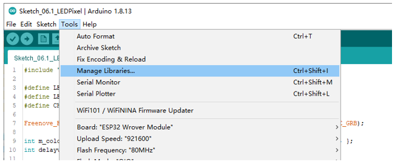
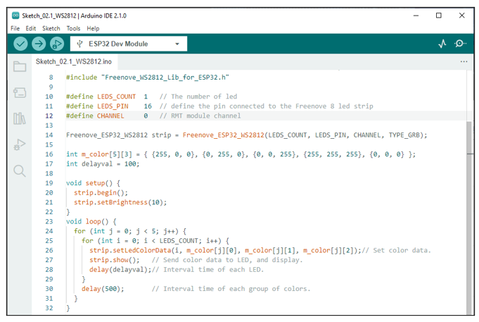

##############################################################################
Chapter WS2812
##############################################################################

This chapter will help you learn to use a more convenient RGB LED lamp, which requires only one GPIO control and can be connected in infinite series in theory. Each LED can be controlled independently.

Project 2.1 WS2812
******************************

Learn the basic usage of ws2812 and use it to flash red, green, blue and white.

Circuit
==============================

Connect your computer and ESP32 with a USB cable.

.. image:: ../_static/imgs/Preface/Preface09.png
    :align: center

Sketch
===============================

This code uses a library named "Freenove_WS2812_Lib_for_ESP32", if you have not installed it, please do so first.

Library is an important feature of the open source world, and we know that Arduino is an open source platform that everyone can contribute to. Libraries are generally licensed under the LGPL, which means you can use them for free to apply to your creations.

How to install the library
-----------------------------------

There are two ways to add libraries.

The first way, open the Arduino IDE, click Tools -> Manager Libraries.

In the pop-up window, Library Manager, search for the name of the Library, "Freenove WS2812 Lib for ESP32". Then click Install.

The second way, open Arduino IDE, click SketchInclude LibraryAdd .ZIP Library, In the pop-up window, find the file named "./Libraries/Freenove_WS2812_Lib_for_ESP32.Zip" which locates in this directory, and click OPEN.

Sketch_02.1_WS2812
-------------------------------------

Download the code to ESP32-WROOM and RGB LED begins to light up in red, green, blue, white and black.

The following is the program code:

.. literalinclude:: ../../../freenove_Kit/C/Sketches/Sketch_02.1_WS2812/Sketch_02.1_WS2812.ino
    :linenos: 
    :language: c
    :dedent:

To use some libraries, first you need to include the library's header file.

.. literalinclude:: ../../../freenove_Kit/C/Sketches/Sketch_02.1_WS2812/Sketch_02.1_WS2812.ino
    :linenos: 
    :language: c
    :lines: 8-8
    :dedent:

Define the pins connected to the ring, the number of LEDs on the ring, and RMT channel values.

.. literalinclude:: ../../../freenove_Kit/C/Sketches/Sketch_02.1_WS2812/Sketch_02.1_WS2812.ino
    :linenos: 
    :language: c
    :lines: 10-12
    :dedent:

Use the above parameters to create a ws2812 object strip.

.. literalinclude:: ../../../freenove_Kit/C/Sketches/Sketch_02.1_WS2812/Sketch_02.1_WS2812.ino
    :linenos: 
    :language: c
    :lines: 14-14
    :dedent:

Define the color values to be used, as red, green, blue, white, and black.

.. literalinclude:: ../../../freenove_Kit/C/Sketches/Sketch_02.1_WS2812/Sketch_02.1_WS2812.ino
    :linenos: 
    :language: c
    :lines: 16-16
    :dedent:

Initialize strip() in setup() and set the brightness.

.. literalinclude:: ../../../freenove_Kit/C/Sketches/Sketch_02.1_WS2812/Sketch_02.1_WS2812.ino
    :linenos: 
    :language: c
    :lines: 20-21
    :dedent:

In the loop(), there are two "for" loops, the internal for loop to light the LED one by one, and the external for loop to switch colors. strip.setLedColorData() is used to set the color, but it does not change immediately. Only when strip.show() is called will the color data be sent to the LED to change the color.

.. literalinclude:: ../../../freenove_Kit/C/Sketches/Sketch_02.1_WS2812/Sketch_02.1_WS2812.ino
    :linenos: 
    :language: c
    :lines: 24-31
    :dedent:

Reference
------------------------------

.. py:function:: Freenove_ESP32_WS2812(u16 n = 8, u8 pin_gpio = 2, u8 chn = 0, LED_TYPE t = TYPE_GRB)	
    
    Constructor to create a Ws2812 object.
    
    Before each use of the constructor, please add " **#include "Freenove_WS2812_Lib_for_ESP32.h** "
    
    **Parameters**
    
    **n:** The number of led.
    
    **pin_gpio:** A pin connected to an led.
    
    **Chn:** RMT channel, which uses channel 0 by default, has a total of eight channels, 0-7. This means that you can use eight LEDPixel modules for the display at the same time, and these modules do not interfere with each other 
    
    **t:** Types of LED.
    
        :red:`TYPE_RGB:` The sequence of Ws2812 module loading color is red, green and blue.
        
        :red:`TYPE_RBG:` The sequence of Ws2812 module loading color is red, blue and green.
        
        :red:`TYPE_GRB:` The sequence of Ws2812 module loading color is green, red and blue.
        
        :red:`TYPE_GBR:` The sequence of Ws2812 module loading color is green, blue and red.
        
        :red:`TYPE_BRG:` The sequence of Ws2812 module loading color is blue, red and green. 
        
        :red:`TYPE_BGR:` The sequence of Ws2812 module loading color is blue,g reen and red. 
    
.. py:function:: void begin(void);	
    
    Initialize the Ws2812 object
    
.. py:function:: void setLedColorData (u8 index, u8 r, u8 g, u8 b);
.. py:function:: void setLedColorData (u8 index, u32 rgb);
.. py:function:: void setLedColor (u8 index, u8 r, u8 g, u8 b);
.. py:function:: void setLedColor (u8 index, u32 rgb);	
    
    Set the color of led with order number n.
    
.. py:function:: void show(void);	
    
    Send the color data to the led and display the set color immediately.
    
.. py:function:: void setBrightness(uint8_t);	
    
    Set the brightness of the LED.
    
If you want to learn more about this library, you can visit the following website: https://github.com/Freenove/Freenove_WS2812_Lib_for_ESP32