##############################################################################
Chapter Bluetooth
##############################################################################

This chapter mainly introduces how to make simple data transmission through Bluetooth of ESP32-WROOM and mobile phones.

Project 3.1 is classic Bluetooth and Project 3.2 is low power Bluetooth.If you are an iPhone user, please start with Project 3.2.

Project 3.1 Bluetooth Passthrough
********************************************

Component List
===================================

.. list-table:: 
   :width: 100%
   :header-rows: 1 
   :align: center
   
   * -  ESP32-WROOM x1
     -  Type C Wire x1

   * -  |Chapter01_00|
     -  |Chapter01_01|

.. |Chapter01_00| image:: ../_static/imgs/1_LED/Chapter01_00.png
.. |Chapter01_01| image:: ../_static/imgs/1_LED/Chapter01_01.png

In this tutorial we need to use a Bluetooth APP called Serial Bluetooth Terminal to assist in the experiment. If you've not installed it yet, please do so by clicking: https://www.appsapk.com/serial-bluetooth-terminal/ The following is its logo.

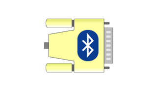

Component knowledge
=======================================

ESP32's integrated Bluetooth function Bluetooth is a short-distance communication system, which can be divided into two types, namely Bluetooth Low Energy(BLE) and Classic Bluetooth. There are two modes for simple data transmission: master mode and slave mode.

Master mode
--------------------------------------

In this mode, works are done in the master device and it can connect with a slave device. And we can search and select slave devices nearby to connect with. When a device initiates connection request in master mode, it requires information of the other Bluetooth devices including their address and pairing passkey. After finishing pairing, it can connect with them directly.

Slave mode
---------------------------------------

The Bluetooth module in slave mode can only accept connection request from a host computer, but cannot initiate a connection request. After connecting with a host device, it can send data to or receive from the host device.

Bluetooth devices can make data interaction with each other, as one is in master mode and the other in slave mode. When they are making data interaction, the Bluetooth device in master mode searches and selects devices nearby to connect to. When establishing connection, they can exchange data. When mobile phones exchange data with ESP32, they are usually in master mode and ESP32 in slave mode.

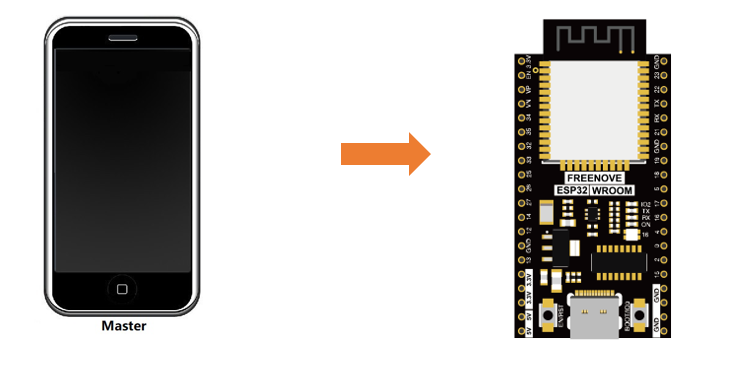

Circuit
================================

Connect Freenove ESP32 to the computer using the USB cable.

.. image:: ../_static/imgs/Preface/Preface09.png
    :align: center

Sketch
===========================

Sketch_03.1_SerialToSerialBT
------------------------------------

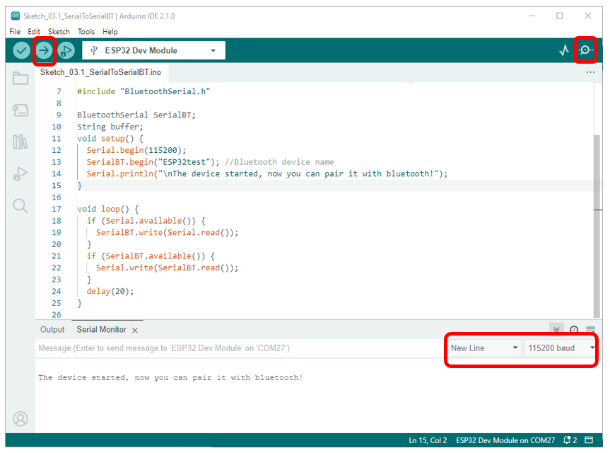

Compile and upload the code to the ESP32-WROOM, open the serial monitor, and set the baud rate to 115200. When you see the serial printing out the character string as below, it indicates that the Bluetooth of ESP32 is ready and waiting to connect with the mobile phone. 

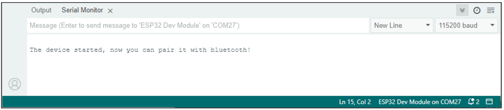

Make sure that the Bluetooth of your phone has been turned on and Serial Bluetooth Terminal has been installed.

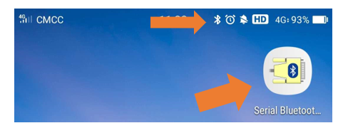

Click "Search" to search Bluetooth devices nearby and select "ESP32 test" to connect to.

.. image:: ../_static/imgs/3_Bluetooth/Chapter03_05.png
    :align: center

Turn on software APP, click the left of the terminal. Select "Devices" 

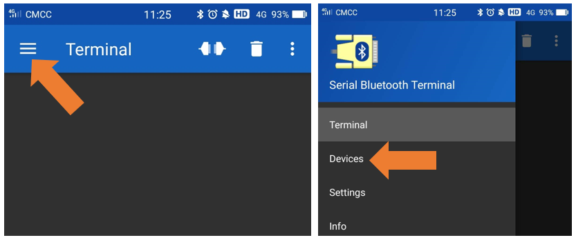

Select ESP32test in classic Bluetooth mode, and a successful connecting prompt will appear as shown on the right illustration.

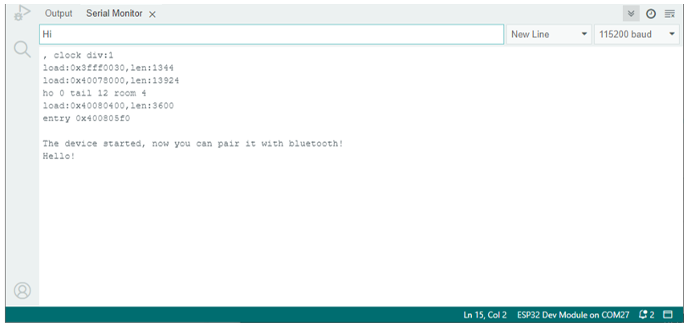

And now data can be transferred between your mobile phone and computer via ESP32-WROOM.

Send 'Hello!'' from your phone, when the computer receives it, reply "Hi" to your phone.

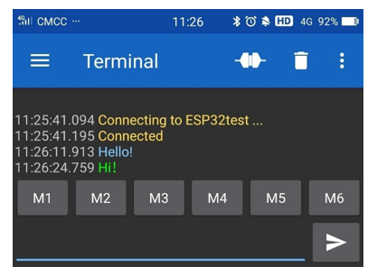

Reference
------------------------------

.. py:function:: Class BluetoothSerial	

    This is a class library used to operate BluetoothSerial, which can directly read and set BluetoothSerial. Here are some member functions:

    **begin(localName,isMaster):** Initialization function of the Bluetooth

    name: name of Bluetooth module; Data type: String

    **isMaster:** bool type, whether to set Bluetooth as Master. By default, it is false.

    **available():** acquire digits sent from the buffer, if not, return 0.

    **read():** read data from Bluetooth, data type of return value is int.

    **readString():** read data from Bluetooth, data type of return value is String.

    **write(val):** send an int data val to Bluetooth.

    **write(str):** send an Srtring data str to Bluetooth.

    **write(buf, len):** Sends the first len data in the buf Array to Bluetooth. 

    **setPin(const char *pin):** set a four-digit Bluetooth pairing code. By default, it is 1234

    **connet(remoteName):** connect a Bluetooth named remoteName, data type: String

    **connect(remoteAddress[]):** connect the physical address of Bluetooth, data type: uint8-t. 

    **disconnect():** disconnect all Bluetooth devices.

    **end():** disconnect all Bluetooth devices and turn off the Bluetooth, release all occupied space

Project 3.2 Bluetooth Low Energy Data Passthrough
**********************************************************

Component List
================================

.. list-table:: 
   :width: 100%
   :header-rows: 1 
   :align: center
   
   * -  ESP32-WROOM x1
     -  Type C Wire x1

   * -  |Chapter01_00|
     -  |Chapter01_01|

Circuit
================================

Connect Freenove ESP32 to the computer using the USB cable.

.. image:: ../_static/imgs/Preface/Preface09.png
    :align: center

Sketch
================================

Sketch_03.2_BLE
----------------------------------

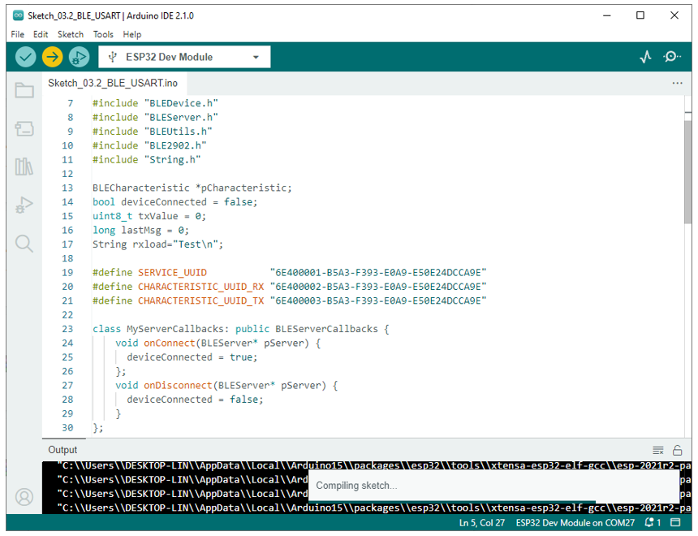

Serial Bluetooth
-------------------------------------

Compile and upload code to ESP32, the operation is similar to the last section.

First, make sure you've turned on the mobile phone Bluetooth, and then open the software.

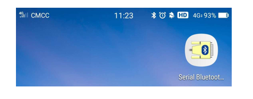

Click "Search" to search Bluetooth devices nearby and select "ESP32 test" to connect to.

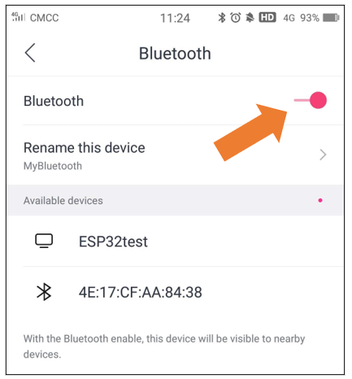

Turn on software APP, click the left of the terminal. Select "Devices" 

.. image:: ../_static/imgs/3_Bluetooth/Chapter03_12.png
    :align: center

Select BLUETOOTHLE, click SCAN to scan Low Energy Bluetooth devices nearby.

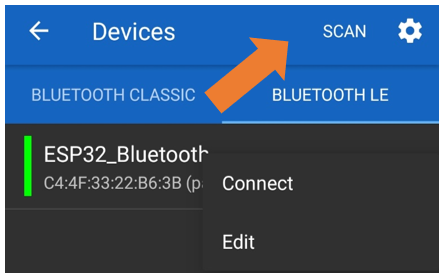

Select"ESP32-Bluetooth"

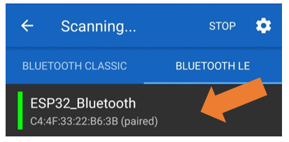

Lightblue
-------------------------------

If you can't install Serial Bluetooth on your phone, try LightBlue.If you do not have this software installed on your phone, you can refer to this link：https://apps.apple.com/us/app/lightblue/id557428110#?platform=iphone.

https://apps.apple.com/us/app/lightblue/id557428110#?platform=iphone.

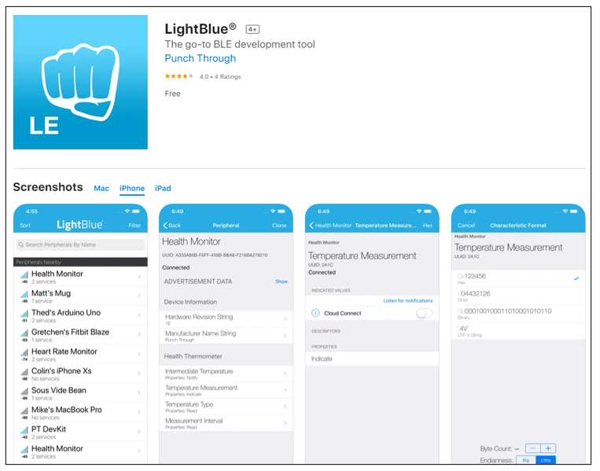

Step1. Upload the code to ESP32.

Step2. Click on serial monitor.

.. image:: ../_static/imgs/3_Bluetooth/Chapter03_16.png
    :align: center

Step3. Set baud rate to 115200.

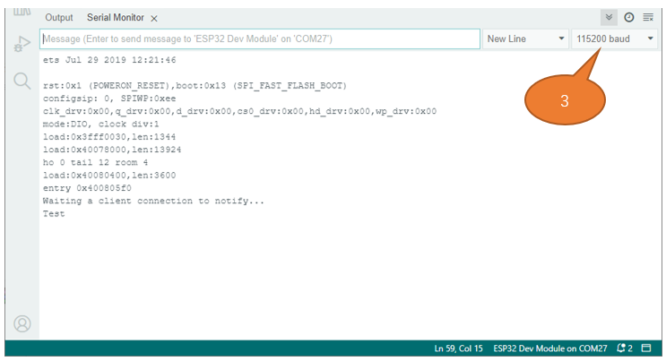

Turn ON Bluetooth on your phone, and open the Lightblue APP. 

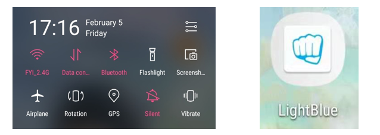

In the Scan page, swipe down to refresh the name of Bluetooth that the phone searches for. Click ESP32_Bluetooth.

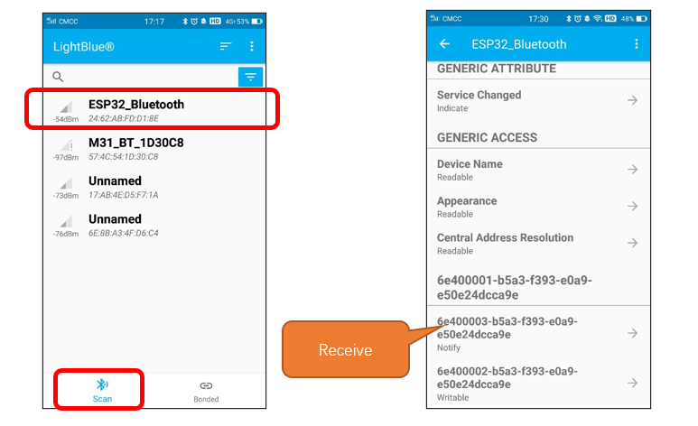

Click "Receive". Select the appropriate Data format in the box to the right of Data Format. For example, HEX for hexadecimal, utf-string for character, Binary for Binary, etc. Then click SUBSCRIBE.

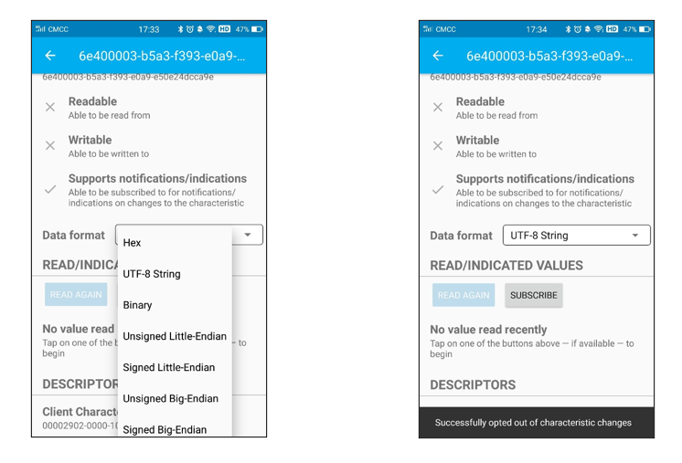

Back to the serial monitor on your computer. You can type anything in the left border of Send, and then click Send. 

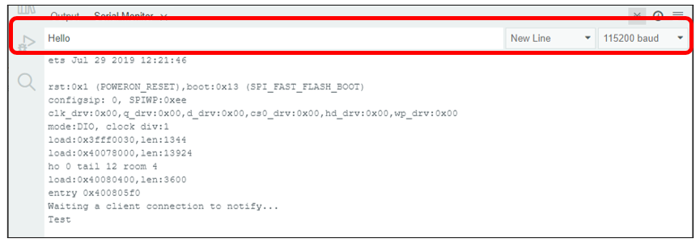

And then you can see the mobile Bluetooth has received the message.

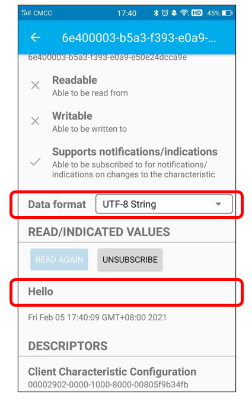

Similarly, you can select "Send" on your phone. Set Data format, and then enter anything in the sending box and click Write to send.

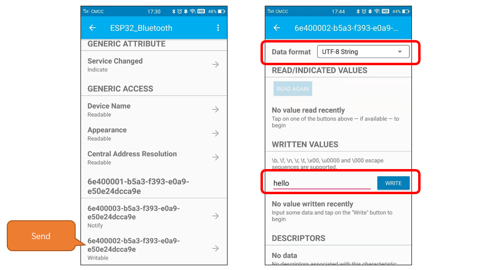

And the computer will receive the message from the mobile Bluetooth.

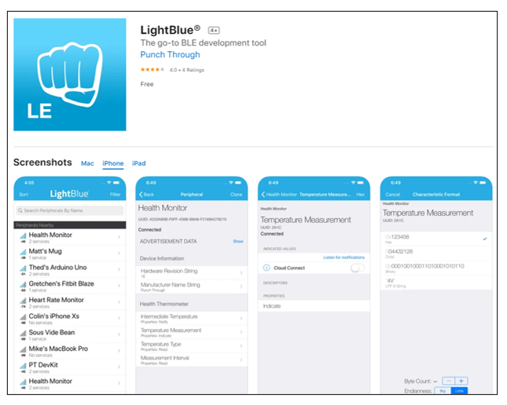

And now data can be transferred between your mobile phone and computer via ESP32-WROOM.

The following is the program code:

.. literalinclude:: ../../../freenove_Kit/C/Sketches/Sketch_03.2_BLE_USART/Sketch_03.2_BLE_USART.ino
    :linenos: 
    :language: c
    :dedent:

Define the specified UUID number for BLE vendor.

.. literalinclude:: ../../../freenove_Kit/C/Sketches/Sketch_03.2_BLE_USART/Sketch_03.2_BLE_USART.ino
    :linenos: 
    :language: c
    :lines: 19-21
    :dedent:

Write a Callback function for BLE server to manage connection of BLE.

.. literalinclude:: ../../../freenove_Kit/C/Sketches/Sketch_03.2_BLE_USART/Sketch_03.2_BLE_USART.ino
    :linenos: 
    :language: c
    :lines: 23-31
    :dedent:

Initialize the BLE function and name it.

.. literalinclude:: ../../../freenove_Kit/C/Sketches/Sketch_03.2_BLE_USART/Sketch_03.2_BLE_USART.ino
    :linenos: 
    :language: c
    :lines: 62-62
    :dedent:

When the mobile phone send data to ESP32 via BLE Bluetooth, it will print them out with serial port; When the serial port of ESP32 receive data, it will send them to mobile via BLE Bluetooth.

.. literalinclude:: ../../../freenove_Kit/C/Sketches/Sketch_03.2_BLE_USART/Sketch_03.2_BLE_USART.ino
    :linenos: 
    :language: c
    :lines: 66-79
    :dedent:

The design for creating the BLE server is:

1. Create a BLE Server

2. Create a BLE Service

3. Create a BLE Characteristic on the Service

4. Create a BLE Descriptor on the characteristic

5. Start the service.

6. Start advertising.

.. literalinclude:: ../../../freenove_Kit/C/Sketches/Sketch_03.2_BLE_USART/Sketch_03.2_BLE_USART.ino
    :linenos: 
    :language: c
    :lines: 45-58
    :dedent: