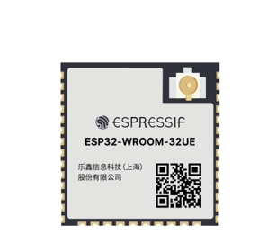
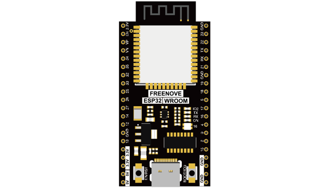
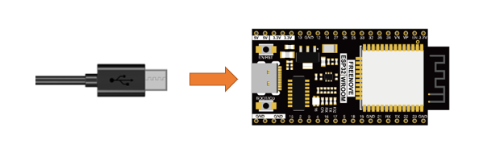
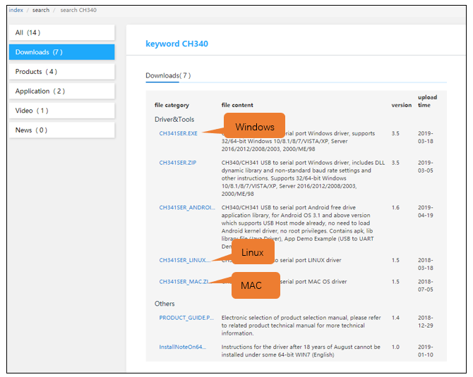
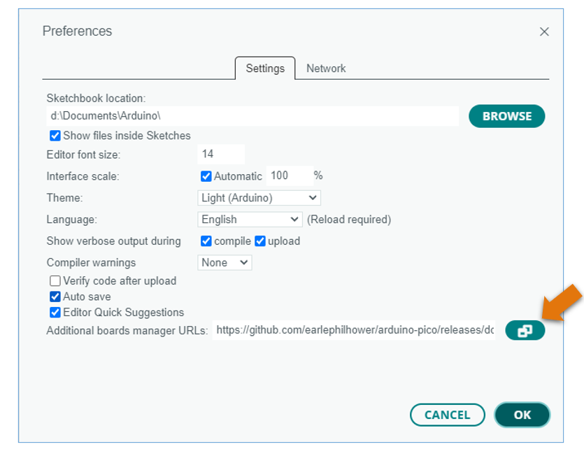

##############################################################################
Preface
##############################################################################

ESP32 is a micro control unit with integrated Wi-Fi launched by Espressif, which features strong properties and integrates rich peripherals. It can be designed and studied as an ordinary Single Chip Micyoco(SCM) chip, or connected to the Internet and used as an Internet of Things device.

ESP32 can be developed using the Arduino platform, which will definitely make it easier for people who have learned arduino to master. Moreover, the code of ESP32 is completely open-source, so beginners can quickly learn how to develop and design IOT smart household products including smart curtains, fans, lamps and clocks.

Generally, ESP32 projects consist of code and circuits. Don't worry even if you've never learned code and circuits, because we will gradually introduce the basic knowledge of C programming language and electronic circuits, from easy to difficult. Our products contain all the electronic components and modules needed to complete these projects. It's especially suitable for beginners.

We divide each project into four parts, namely Component List, Component Knowledge, Circuit and Code. Component List helps you to prepare material for the experiment more quickly. Component Knowledge allows you to quickly understand new electronic modules or components, while Circuit helps you understand the operating principle of the circuit. And Code allows you to easily master the use of SEP32 and accessory kit. After finishing all the projects in this tutorial, you can also use these components and modules to make products such as smart household, smart cars and robots to transform your creative ideas into prototypes and new and innovative products.

In addition, if you have any difficulties or questions with this tutorial or toolkit, feel free to ask for our quick and free technical support through support@freenove.com 

ESP32-WROOM
**************************

ESP32-WROOM has launched a total of two antenna packages, PCB on-board antenna and IPEX antenna respectively. The PCB on-board antenna is an integrated antenna in the chip module itself, so it is convenient to carry and design. The IPEX antenna is a metal antenna derived from the integrated antenna of the chip module itself, which is used to enhance the signal of the module.

.. list-table:: 
   :width: 80%
   :header-rows: 1 
   :align: center
   
   * -  PCB on-board antenna 
     -  IPEX antenna

   * -  |Preface00|
     -  |Preface01|

.. |Preface00| image:: ../_static/imgs/Preface/Preface00.png

In this tutorial, the ESP32-WROOM is designed based on the PCB on-board antenna-packaged ESP32-WROOM-32E module. 

.. list-table:: 
   :width: 80%
   :header-rows: 1 
   :align: center
   
   * -  ESP32-WROOM
   * -  |Preface02|

The hardware interfaces of ESP32-WROOM are distributed as follows:

.. image:: ../_static/imgs/Preface/Preface03.png
    :align: center

Compare the left and right images. We've boxed off the resources on the ESP32-WROOM in different colors to facilitate your understanding of the ESP32-WROOM.

.. list-table:: 
   :width: 80%
   :header-rows: 1 
   :align: center
   
   * -  Box color 
     -  Corresponding resources introduction

   * -  |Preface04|
     -  GPIO pin

   * -  |Preface05|
     -  LED indicator

   * -  |Preface06|
     -  WS2812

   * -  |Preface07|
     -  Reset button, Boot mode selection button 

   * -  |Preface08|
     -  Type C port

.. |Preface08| image:: ../_static/imgs/Preface/Preface08.png

For more information, please visit: https://www.espressif.com/sites/default/files/documentation/esp32-wroom-32e_esp32-wroom-32ue_datasheet_en.pdf

CH340 (Importance)
*******************************************

ESP32 uses CH340 to download codes. So before using it, we need to install CH340 driver in our computers.

Windows
=========================================

Check whether CH340 has been installed
-----------------------------------------

1.	Connect your computer and ESP32 with a USB cable.

2.	Turn to the main interface of your computer, select "This PC" and right-click to select "Manage".

3.	Click "Device Manager". If your computer has installed CH340, you can see"USB-SERIAL CH340 (COMx)". And you can click :ref:`here <programming>` to move to the next step.

Installing CH340
-------------------------------------

1.	First, download CH340 driver, click http://www.wch-ic.com/search?q=CH340&t=downloads to download the appropriate one based on your operating system.

If you would not like to download the installation package, you can open " **Freenove_ESP32_WROOM_Board/CH340** ", we have prepared the installation package.

2.	Open the folder "Freenove_ESP32_WROOM_Board/CH340/Windows/"

3.	Double click " **CH341SER.EXE** ".

4.	Click "INSTALL" and wait for the installation to complete.

5.	Install successfully. Close all interfaces.

6.	When ESP32 is connected to computer, select "This PC", right-click to select "Manage" and click "Device Manager" in the newly pop-up dialog box, and you can see the following interface.

7.	So far, CH340 has been installed successfully. Close all dialog boxes. 

MAC
==================================

First, download CH340 driver, click http://www.wch-ic.com/search?q=CH340&t=downloads to download the appropriate one based on your operating system.

.. image:: ../_static/imgs/Preface/Preface19.png
    :align: center

If you would not like to download the installation package, you can open "Freenove_ESP32_WROOM_Board/CH340", we have prepared the installation package.

Second, open the folder "Freenove_ESP32_WROOM_Board/CH340/MAC/"

Third, click Continue.

Fourth, click Install.

Then, waiting Finsh.

Finally, restart your PC.

If you still haven't installed the CH340 by following the steps above, you can view readme.pdf to install it.

.. _programming:

Programming Software
********************************

Arduino Software (IDE) is used to write and upload the code for Arduino Board.

First, install Arduino Software (IDE): visit https://www.arduino.cc, click "Download" to enter the download page.

Select and download corresponding installer according to your operating system. If you are a windows user, please select the "Windows" to download and install it correctly.

After the download completes, run the installer. For Windows users, there may pop up an installation dialog box of driver during the installation process. When it popes up, please allow the installation.

After installation completes, an Arduino Software shortcut will be generated in the desktop. Run the Arduino Software.

.. image:: ../_static/imgs/Preface/Preface28.png
    :align: center

The interface of Arduino Software is as follows:

Programs written with Arduino Software (IDE) are called sketches. These sketches are written in the text editor and saved with the file extension.ino. The editor features text cutting/pasting and searching/replacing. The message area gives feedback while saving and exporting and also displays errors. The console displays text output by the Arduino Software (IDE), including complete error messages and other information. The bottom right-hand corner of the window displays the configured board and serial port. The toolbar buttons allow you to verify and upload programs, create, open, and save sketches, and open the serial monitor.

.. list-table:: 
   :width: 100%
   :align: center
   
   * -  |Preface30|
     -  Verify 
      
        Check your code for compile errors.

   * -  |Preface31|
     -  Upload 
      
        Compile your code and upload them to the configured board. 

   * -  |Preface32|
     -  Debug
      
        Debug code running on the board. (Some development boards do not 
        
        support this function)
   * -  |Preface33|
     -  Development board selection
      
        Configure the support package and upload port of the development board.

   * -  |Preface34|
     -  Serial Plotter
      
        Receive serial port data and plot it in a discounted graph.

   * -  |Preface35|
     -  Serial Monitor 
      
        Open the serial monitor. 

Additional commands are found within the five menus: File, Edit, Sketch, Tools, Help. The menus are context sensitive, which means only those items relevant to the work currently being carried out are available.

Environment Configuration
************************************

First, open the software platform arduino, and then click File in Menus and select Preferences.

Second, click on the symbol behind "Additional Boards Manager URLs" 

Third, fill in https://espressif.github.io/arduino-esp32/package_esp32_index.json in the new window, click OK, and click OK on the Preferences window again.

.. note::
    
    if you copy and paste the URL directly, you may lose the "-". Please check carefully to make sure the link is correct.

Fourth, click "Boards Manager". Enter "esp32" in Boards manager, select 2.0.9, and  click "INSTALL".

Arduino will download these files automaticly. Wait for the installation to complete.

When finishing installation, click Tools in the Menus again and select Board: "ESP32 Dev Module", and then you can see information of ESP32. 

Keep the default Settings.

Notes for GPIO
*************************************

Strapping Pin
================================

There are five Strapping pins for ESP32: MTDI、GPIO0、GPIO2、MTDO、GPIO5。

With the release of the chip's system reset (power-on reset, RTC watchdog reset, undervoltage reset), the strapping pins sample the level and store it in the latch as "0" or "1" ", and keep it until the chip is powered off or turned off.

Each Strapping pin is connecting to internal pull-up/pull-down.  Connecting to high-impedance external circuit or without an external connection, a strapping pin's default value of input level will be determined by internal weak pull-up/pull-down. To change the value of the Strapping, users can apply an external pull-down/pull-up resistor, or use the GPIO of the host MCU to control the level of the strapping pin when the ESP32's power on reset is released.

**When releasing the reset, the strapping pin has the same function as a normal pin.**

The followings are default configurations of these five strapping pins at power-on and their functions under the corresponding configuration.

If you have any difficulties or questions with this tutorial or toolkit, feel free to ask for our quick and free technical support through support@freenove.com at any time.

