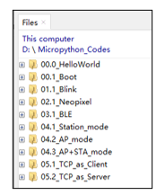
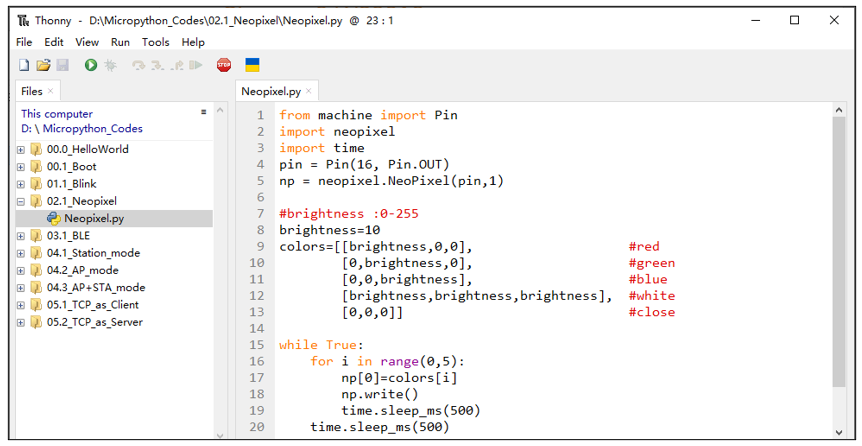
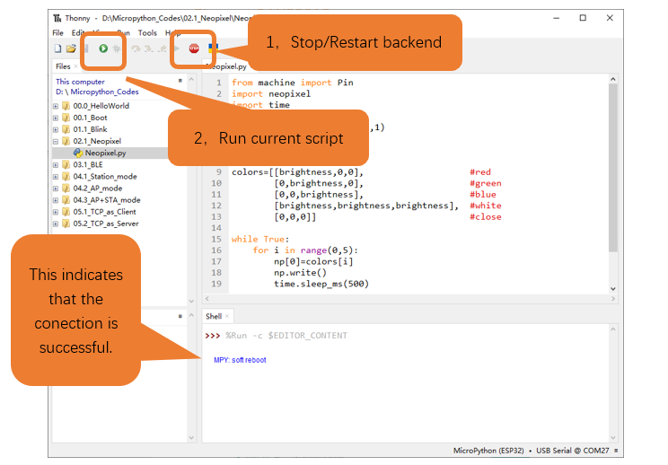
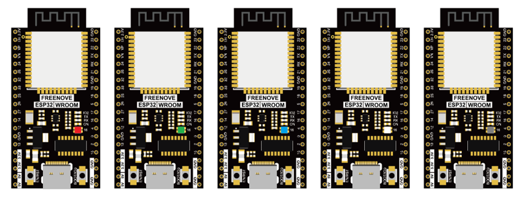

##############################################################################
Chapter WS2812
##############################################################################

This chapter will help you learn to use a more convenient RGB LED lamp, which requires only one GPIO control and can be connected in infinite series in theory. Each LED can be controlled independently.

Component List
===============================

.. list-table:: 
   :width: 100%
   :header-rows: 1 
   :align: center
   
   * -  ESP32-WROOM x1
     -  USB cable

   * -  |Chapter01_00|
     -  |Chapter01_01|

.. |Chapter01_00| image:: ../_static/imgs/1_LED/Chapter01_00.png
.. |Chapter01_01| image:: ../_static/imgs/1_LED/Chapter01_01.png

Circuit
============================

Connect your computer and ESP32 with a USB cable.

.. image:: ../_static/imgs/Preface/Preface09.png
    :align: center

Code
=============================

Codes used in this tutorial are saved in "Freenove_ESP32_WROOM_Board/Python/Python_Codes". You can move the codes to any location. For example, we save the codes in Disk(D) with the path of "D:/Micropython_Codes".

02.1_Neopixels
---------------------------

Open "Thonny", click "This computer" -> "D:" -> "Micropython_Codes".

Expand folder “02.1_Neopixel” and double click “Neopixel.py” to open it. As shown in the illustration below.

Make sure ESP32 has been connected with the computer with ESP32 correctly. Click “Stop/Restart backend” or press the reset button, and then wait to see what interface will show up.

Click “Run current script” shown in the box above, and RGB LED begins to light up in red, green, blue, white and black.

The following is the program code:

.. literalinclude:: ../../../freenove_Kit/Python/Python_Codes/02.1_Neopixel/Neopixel.py
    :linenos: 
    :language: python
    :dedent:

Each time when using the functions of ESP32, you need to import modules corresponding to those functions: Import sleep_ms module of time module and Pin module of machine module.

.. literalinclude:: ../../../freenove_Kit/Python/Python_Codes/02.1_Neopixel/Neopixel.py
    :linenos: 
    :language: python
    :lines: 1-3
    :dedent:

Initializes the neopixel pin.

.. literalinclude:: ../../../freenove_Kit/Python/Python_Codes/02.1_Neopixel/Neopixel.py
    :linenos: 
    :language: python
    :lines: 4-5
    :dedent:

Define the color values to be used, as red, green, blue, white, and black.

.. literalinclude:: ../../../freenove_Kit/Python/Python_Codes/02.1_Neopixel/Neopixel.py
    :linenos: 
    :language: python
    :lines: 9-13
    :dedent:

Displays a color every 500 milliseconds. After each execution of the for loop, wait 500 milliseconds. Each time the write() function is called, the corresponding color sample is displayed.

.. literalinclude:: ../../../freenove_Kit/Python/Python_Codes/02.1_Neopixel/Neopixel.py
    :linenos: 
    :language: python
    :lines: 15-20
    :dedent: