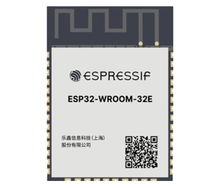
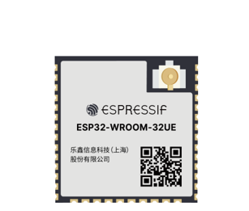
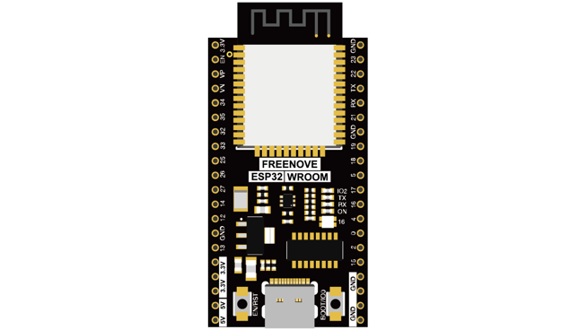
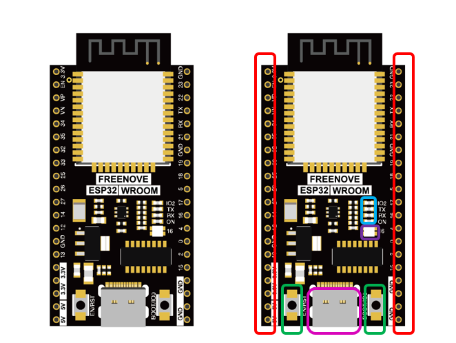

##############################################################################
Preface
##############################################################################

ESP32 is a micro control unit with integrated Wi-Fi launched by Espressif, which features strong properties and integrates rich peripherals. It can be designed and studied as an ordinary Single Chip Micyoco(SCM) chip, or connected to the Internet and used as an Internet of Things device.

ESP32 can be developed using the Arduino platform, which will definitely make it easier for people who have learned arduino to master. Moreover, the code of ESP32 is completely open-source, so beginners can quickly learn how to develop and design IOT smart household products including smart curtains, fans, lamps and clocks.

Generally, ESP32 projects consist of code and circuits. Don't worry even if you've never learned code and circuits, because we will gradually introduce the basic knowledge of C programming language and electronic circuits, from easy to difficult. Our products contain all the electronic components and modules needed to complete these projects. It's especially suitable for beginners.

We divide each project into four parts, namely Component List, Component Knowledge, Circuit and Code. Component List helps you to prepare material for the experiment more quickly. Component Knowledge allows you to quickly understand new electronic modules or components, while Circuit helps you understand the operating principle of the circuit. And Code allows you to easily master the use of SEP32 and accessory kit. After finishing all the projects in this tutorial, you can also use these components and modules to make products such as smart household, smart cars and robots to transform your creative ideas into prototypes and new and innovative products.

In addition, if you have any difficulties or questions with this tutorial or toolkit, feel free to ask for our quick and free technical support through support@freenove.com 

ESP32-WROOM
**************************

ESP32-WROOM has launched a total of two antenna packages, PCB on-board antenna and IPEX antenna respectively. The PCB on-board antenna is an integrated antenna in the chip module itself, so it is convenient to carry and design. The IPEX antenna is a metal antenna derived from the integrated antenna of the chip module itself, which is used to enhance the signal of the module.

.. list-table:: 
   :width: 80%
   :header-rows: 1 
   :align: center
   
   * -  PCB on-board antenna 
     -  IPEX antenna

   * -  |Preface00|
     -  |Preface01|

In this tutorial, the ESP32-WROOM is designed based on the PCB on-board antenna-packaged ESP32-WROOM-32E module. 

.. list-table:: 
   :width: 80%
   :header-rows: 1 
   :align: center
   
   * -  ESP32-WROOM
   * -  |Preface02|

The hardware interfaces of ESP32-WROOM are distributed as follows:

Compare the left and right images. We've boxed off the resources on the ESP32-WROOM in different colors to facilitate your understanding of the ESP32-WROOM.

.. list-table:: 
   :width: 80%
   :header-rows: 1 
   :align: center
   
   * -  Box color 
     -  Corresponding resources introduction

   * -  |Preface04|
     -  GPIO pin

   * -  |Preface05|
     -  LED indicator

   * -  |Preface06|
     -  WS2812

   * -  |Preface07|
     -  Reset button, Boot mode selection button 

   * -  |Preface08|
     -  Type C port

For more information, please visit: https://www.espressif.com/sites/default/files/documentation/esp32-wroom-32e_esp32-wroom-32ue_datasheet_en.pdf